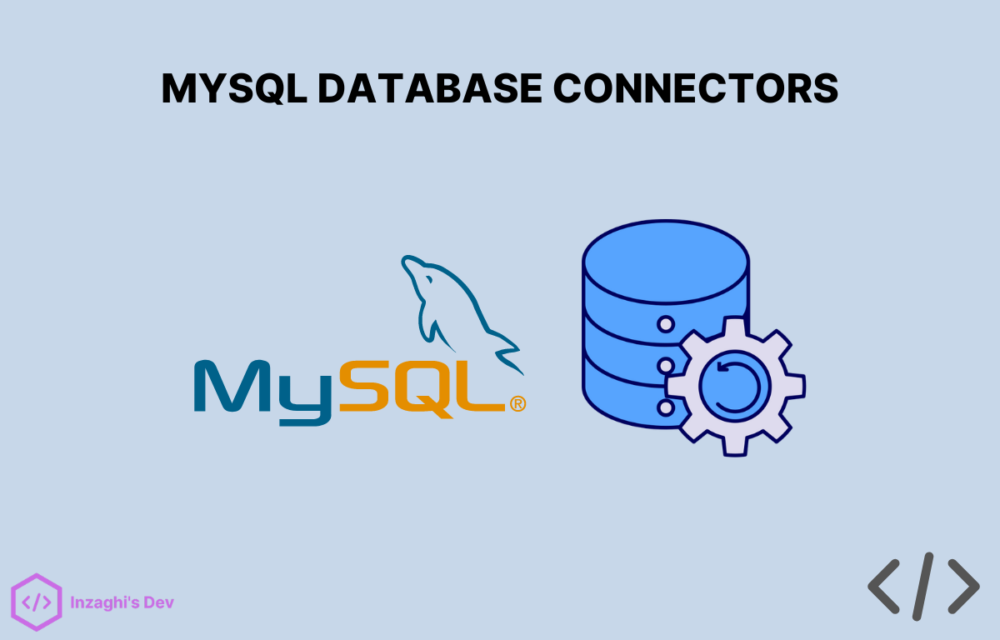

# MySQL Database Connections



Merupakan Cara menghubungkan Database dalam berbagai macam Bahasa Pemrograman seperti PHP, Python, Node.js (JavaScript), C#, Java, Go(lang), dll.

Sumber : [Notion - Connecting MySQL with Different Programming Languages](https://inzaghi-poshaf.notion.site/Connecting-MySQL-with-Different-Programming-Languages-a401755e2bfc434fbcee66477773b93c)

## Programs in Different Languages

Berikut ini adalah Koneksi Database MySQL dalam beberapa Bahasa Pemrograman yang Berbeda.

1. Python

> Metode : mysql-connector-python (Library)

Kode Program :

```
import mysql.connector

# Establish the connection
conn = mysql.connector.connect(
    host="your_host",
    user="your_username",
    password="your_password",
    database="your_database"
)

# Create a cursor object
cursor = conn.cursor()

# Execute a query
cursor.execute("SELECT * FROM your_table")

# Fetch and print the result
for row in cursor.fetchall():
    print(row)

# Close the connection
conn.close()
```

2. PHP

> Metode : mysqli (Extension)

Kode Program :

```
<?php
$servername = "your_host";
$username = "your_username";
$password = "your_password";
$dbname = "your_database";

// Create connection
$conn = new mysqli($servername, $username, $password, $dbname);

// Check connection
if ($conn->connect_error) {
    die("Connection failed: " . $conn->connect_error);
}

// Execute a query
$sql = "SELECT * FROM your_table";
$result = $conn->query($sql);

// Fetch and print the result
if ($result->num_rows > 0) {
    while($row = $result->fetch_assoc()) {
        echo "id: " . $row["id"]. " - Name: " . $row["name"]. "<br>";
    }
} else {
    echo "0 results";
}

// Close the connection
$conn->close();
?>
```

3. JavaScript (Node.js)

> Metode : mysql (Package)

Kode Program :

```
const mysql = require("mysql");

const connection = mysql.createConnection({
  host: "your_host",
  user: "your_username",
  password: "your_password",
  database: "your_database",
});

connection.connect((err) => {
  if (err) {
    console.error("Error connecting: " + err.stack);
    return;
  }
  console.log("Connected as id " + connection.threadId);
});

// Execute a query
connection.query("SELECT * FROM your_table", (error, results, fields) => {
  if (error) throw error;
  console.log(results);
});

// Close the connection
connection.end();
```

4. Java

> Metode : JDBC (Library)

Kode Program :

```
import java.sql.Connection;
import java.sql.DriverManager;
import java.sql.ResultSet;
import java.sql.Statement;

public class MySQLConnectJDBC {
    public static void main(String[] args) {
        String url = "jdbc:mysql://your_host:3306/your_database";
        String user = "your_username";
        String password = "your_password";

        try {
            // Establish the connection
            Connection conn = DriverManager.getConnection(url, user, password);

            // Create a statement object
            Statement stmt = conn.createStatement();

            // Execute a query
            ResultSet rs = stmt.executeQuery("SELECT * FROM your_table");

            // Process the result
            while (rs.next()) {
                System.out.println(rs.getString("column_name"));
            }

            // Close the connection
            conn.close();
        } catch (Exception e) {
            e.printStackTrace();
        }
    }
}
```

5. C#

> Metode : MySql.Data.MySqlClient (Library)

Kode Program :

```
using MySql.Data.MySqlClient;
using System;

class Program
{
    static void Main()
    {
        string connectionString = "server=your_host;user=your_username;database=your_database;password=your_password;";

        using (var conn = new MySqlConnection(connectionString))
        {
            conn.Open();

            // Create a command object
            using (var cmd = new MySqlCommand("SELECT * FROM your_table", conn))
            {
                using (var reader = cmd.ExecuteReader())
                {
                    while (reader.Read())
                    {
                        Console.WriteLine(reader["column_name"].ToString());
                    }
                }
            }
        }
    }
}
```

6. C++

> Metode : MySQL Connector/C++ (Library)

Kode Program :

```
#include <mysql_driver.h>
#include <mysql_connection.h>
#include <cppconn/statement.h>
#include <cppconn/resultset.h>
#include <iostream>

int main() {
    sql::mysql::MySQL_Driver* driver;
    sql::Connection* conn;
    sql::Statement* stmt;
    sql::ResultSet* res;

    try {
        // Create a driver instance
        driver = sql::mysql::get_mysql_driver_instance();

        // Establish the connection
        conn = driver->connect("tcp://your_host:3306", "your_username", "your_password");

        // Select the database
        conn->setSchema("your_database");

        // Create a statement
        stmt = conn->createStatement();

        // Execute a query
        res = stmt->executeQuery("SELECT * FROM your_table");

        // Process the result
        while (res->next()) {
            std::cout << "Column: " << res->getString("column_name") << std::endl;
        }

        // Clean up
        delete res;
        delete stmt;
        delete conn;
    } catch (sql::SQLException& e) {
        std::cerr << "ERROR: SQLException" << std::endl;
        std::cerr << "Message: " << e.what() << std::endl;
        std::cerr << "MySQL Error Code: " << e.getErrorCode() << std::endl;
    }

    return 0;
}
```

7. Go

> Metode : go-sql-driver/mysql (Package)

Kode Program :

```
package main

import (
	"database/sql"
	"fmt"

	_ "github.com/go-sql-driver/mysql"
)

func main() {
    // Establish the connection
    db, err := sql.Open("mysql", "your_username:your_password@tcp(your_host:3306)/your_database")
    if err != nil {
        panic(err)
    }
    defer db.Close()

    // Execute a query
    rows, err := db.Query("SELECT * FROM your_table")
    if err != nil {
        panic(err)
    }
    defer rows.Close()

    // Fetch and print the result
    for rows.Next() {
        var id int
        var name string
        err := rows.Scan(&id, &name)
        if err != nil {
            panic(err)
        }
        fmt.Println(id, name)
    }
}
```

8. Dart

> Metode : mysql1 (Package)

Kode Program :

```
import 'package:mysql1/mysql1.dart';

void main() async {
  // Configuration settings
  final settings = ConnectionSettings(
    host: 'your_host',
    port: 3306,
    user: 'your_username',
    password: 'your_password',
    db: 'your_database',
  );

  // Establish the connection
  final conn = await MySqlConnection.connect(settings);
  print('Connection established');

  // Execute a query
  var results = await conn.query('SELECT * FROM your_table');

  // Process the result
  for (var row in results) {
    print('Column: ${row[0]}');
  }

  // Close the connection
  await conn.close();
}
```

9. Kotlin

> Metode : mysql-connector-java (Library)

Kode Program :

```
import java.sql.Connection
import java.sql.DriverManager
import java.sql.ResultSet

fun main() {
    val url = "jdbc:mysql://localhost:3306/yourdatabase"
    val username = "yourusername"
    val password = "yourpassword"

    var connection: Connection? = null

    try {
        connection = DriverManager.getConnection(url, username, password)

        val statement = connection.createStatement()
        val resultSet = statement.executeQuery("SELECT * FROM yourtable")

        while (resultSet.next()) {
            println(resultSet.getString("columnname"))
        }
    } catch (e: Exception) {
        e.printStackTrace()
    } finally {
        connection?.close()
    }
}
```

10. Swift

> Metode : mysql-swift (Package)

Kode Program :

```
import MySQL

let connection = try MySQL.Connection(
    host: "localhost",
    user: "yourusername",
    password: "yourpassword",
    database: "yourdatabase"
)
try connection.open()

let statement = try connection.prepare(query: "SELECT * FROM yourtable")
let results = try statement.execute()

for row in results {
    print(row)
}

connection.close()
```

11. Ruby

> Metode : mysql2 (Gem)

Kode Program :

```
require 'mysql2'

# Establish the connection
client = Mysql2::Client.new(
  host: "your_host",
  username: "your_username",
  password: "your_password",
  database: "your_database"
)

# Execute a query
results = client.query("SELECT * FROM your_table")

# Fetch and print the result
results.each do |row|
  puts row
end
```

12. R

> Metode : RMySQL (Package)

Kode Program :

```
install.packages("RMySQL")
library(RMySQL)

con <- dbConnect(MySQL(), user = 'yourusername', password = 'yourpassword', host = 'localhost', dbname = 'yourdatabase')

result <- dbSendQuery(con, "SELECT * FROM yourtable")
data <- fetch(result)

print(data)

dbDisconnect(con)
```

.
